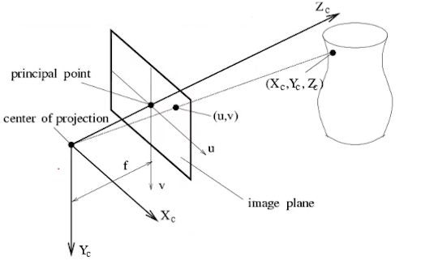

## 齐次坐标系
 二维笛卡尔坐标系下点 $(X,Y)$ 在齐次坐标系下表示为$(x,y,w)$，其中$X=x/w$，$Y=y/w$
- 点可表示为 $p= [a \quad b \quad 1][\vec{x} \quad \vec{y}\quad o]$，向量可表示为 $p= [a \quad b \quad 0][\vec{x} \quad \vec{y}\quad o]$
- 齐次坐标系可使得**平移变换**由以下矩阵运算表示

$$
M' = \begin{bmatrix} 
1 & 0 & t_x \\ 
0 & 1 & t_y \\ 
0 & 0 & 1 
\end{bmatrix}\begin{bmatrix} 
x \\ 
y\\ 
1 
\end{bmatrix}
$$

## 2D 坐标变换

某一点$P$经过平移、旋转、缩放后可得到变换后的点$P'$：
$$ 
P' =\begin{bmatrix} 
1 & 0 & t_x \\ 
0 & 1 & t_y \\ 
0 & 0 & 1 
\end{bmatrix} \begin{bmatrix} 
cos\theta & -sin\theta & 0 \\ 
sin\theta & cos\theta & 0 \\ 
0 & 0 & 1 
\end{bmatrix} \begin{bmatrix} 
s_x & 0 & 0 \\ 
0 & s_y & 0 \\ 
0 & 0 & 1 
\end{bmatrix} \begin{bmatrix} 
x \\ 
y\\ 
1 
\end{bmatrix}
$$
$$
= \begin{bmatrix} 
cos\theta & -sin\theta & t_x \\ 
sin\theta & cos\theta & t_y \\ 
0 & 0 & 1 
\end{bmatrix} \begin{bmatrix} 
s_x & 0 & 0 \\ 
0 & s_y & 0 \\ 
0 & 0 & 1 
\end{bmatrix} \begin{bmatrix} 
x \\ 
y\\ 
1 
\end{bmatrix}
$$

$$
= \begin{bmatrix} 
R S & t \\ 
0 & 1 
\end{bmatrix} \begin{bmatrix} 
x \\ 
y\\ 
1 
\end{bmatrix}
$$

## 3D坐标变换

3维旋转矩阵
$$
R_x(\alpha) = 
\begin{bmatrix} 
1 & 0 & 0 \\
0 & cos\alpha & -sin\alpha \\
0 & sin\alpha & cos\alpha
\end{bmatrix}, R_y(\beta) = 
\begin{bmatrix} 
cos\beta &  -sin\beta & 0 \\
0 & 1 & 0 \\
-sin\beta & 0 & cos\beta
\end{bmatrix}, R_z(\gamma) = 
\begin{bmatrix} 
cos\gamma & -sin\gamma & 0 \\
sin\gamma & cos\gamma & 0 \\
0 & 0 & 1
\end{bmatrix}
$$
$$
R_{3 \times 3} = R_x(\alpha) R_y(\beta) R_z(\gamma)
$$
某一点$P$经过平移、旋转、缩放后可得到变换后的点$P'$：

$$
P' = \begin{bmatrix}
RS & T \\
0 & 1
\end{bmatrix}_{4 \times 4} \begin{bmatrix}
x \\
y \\
z \\
1
\end{bmatrix}
$$

## 相机内参

- 以相机光心为坐标系原点，z轴指向相机前方，x向右，y向左，建立3维相机空间坐标系，设空间中某一点坐标：$P(X,Y,Z)$
- 该点投影在像平面的坐标记作$p(x,y)$

由相似三角形可知：
$$ 
\frac{Z}{f} = \frac{X}{x} = \frac{Y}{y}
$$

$$
x=f \frac{X}{Z},\quad y = f \frac{Y}{Z}
$$

将点$m(x,y)$ 在平移$[c_x,c_y]$ 缩放$[\alpha, \beta]$转换为像平面坐标系下坐标 $P'(u,v)$：
$$
u = x\alpha + c_x, \quad v = y\beta + c_y
$$

记：
$$
f_x = f\alpha, \quad f_y = f\beta，单位是像素
$$

则$P->P'$转换关系为：
$$
u = f_x \frac{X}{Z}+c_x,\quad v = f_y \frac{Y}{Z}+c_y
$$

$$
P' = Z\begin{bmatrix} 
u \\ 
v \\ 
1 
\end{bmatrix} = \begin{bmatrix} 
f_x & 0 & c_x \\ 
0 & f_y & c_y \\
0 & 0 & 1
\end{bmatrix} \begin{bmatrix} 
X \\ 
Y \\ 
Z 
\end{bmatrix}
=
KP
$$

即得相机内参矩阵$K$，其中 $f_x,f_y,c_x,c_y$ 的单位为像素， $c_x,c_y$ 是原点的平移尺寸。$f$为像距，$dX,dY$ 分别表示X,Y方向上的一个像素在相机感光板上的[物理长度](https://www.zhihu.com/search?q=%E7%89%A9%E7%90%86%E9%95%BF%E5%BA%A6&search_source=Entity&hybrid_search_source=Entity&hybrid_search_extra=%7B%22sourceType%22%3A%22article%22%2C%22sourceId%22%3A94244568%7D)（即一个像素在感光板上是多少毫米），$fx=f/dX, fy=f/dY$。

## 相机外参

上述计算公式是由相机坐标系转到像平面坐标系的计算逻辑，下面将世界坐标系$P_w$变换到相机坐标系中的$P$。
$$
P_w = 
\begin{bmatrix} 
x_w \\ 
y_w \\
z_w \\
1
\end{bmatrix}
$$

相机位资由旋转矩阵$R$和平移向量$T$描述（$R$和$T$即为相机的外参），即
$$
P = \begin{bmatrix}
RS & T \\
0 & 1
\end{bmatrix}_{4 \times 4} \begin{bmatrix}
x \\
y \\
z \\
1
\end{bmatrix}

$$
$$
P' = \begin{bmatrix} 
K & 0 \\ 
\end{bmatrix}_{3 \times 4} \begin{bmatrix} 
R & T \\ 
0 & 1 \\
\end{bmatrix}_{4 \times 4} P_w 
= \begin{bmatrix} 
f_x & 0 & c_x & 0 \\ 
0 & f_y & c_y & 0 \\
0 & 0 & 1 & 0
\end{bmatrix} \begin{bmatrix}
r_{11} & r_{12} & r_{13} & t_1 \\
r_{21} & r_{22} & r_{23} & t_1 \\
r_{31} & r_{32} & r_{33} & t_3 \\
0 & 0 & 0 & 1 
\end{bmatrix} \begin{bmatrix}
x \\
y \\
z \\
1
\end{bmatrix}

$$

## OPENCV 相机标定原理

TODO: DLT超定解求解逻辑